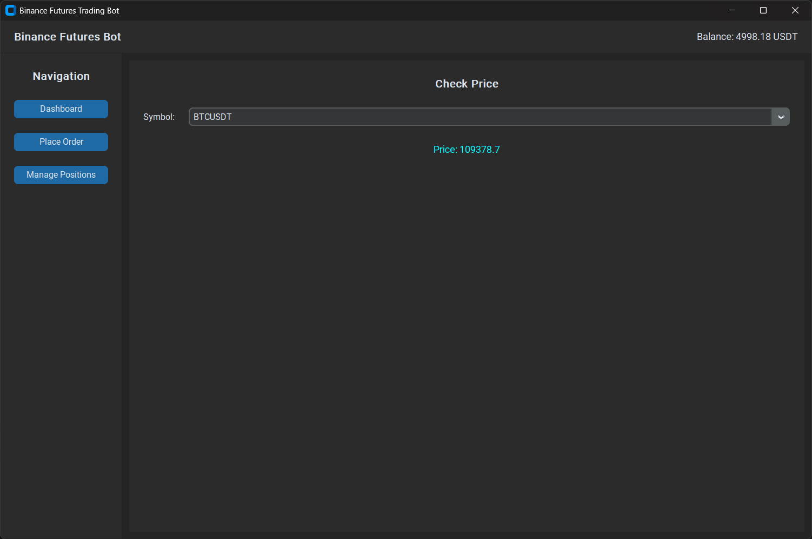
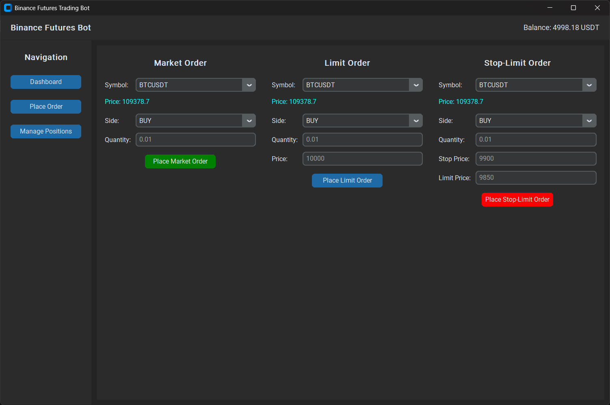
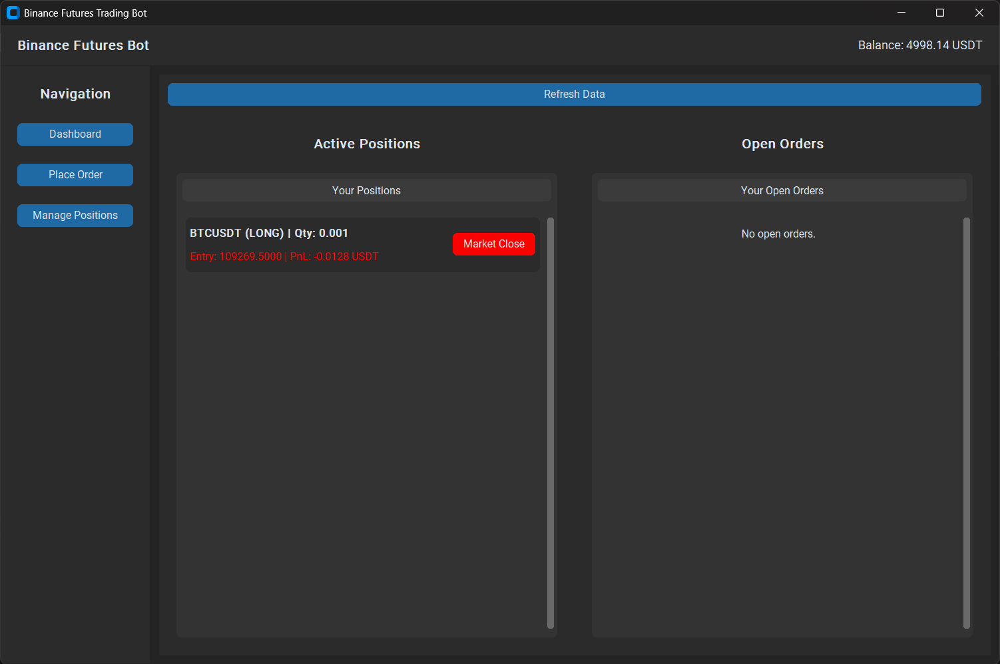

# Binance Futures Trading Bot - Setup Guide

## 📋 Requirements

### Python Requirements
```txt
python-binance==1.0.19
requests>=2.31.0
customtkinter
pyinstaller
dotenv
```

Save as `req.txt` and install with:
```bash
pip install -r req.txt
```

## 🚀 Setup Instructions

### 1\. Register for Binance Futures Testnet

1.  Visit: [https://testnet.binancefuture.com](https://testnet.binancefuture.com)
2.  Click "Register" or login with Google
3.  Complete registration process

### 2\. Generate API Credentials

1.  Log into testnet dashboard at [https://testnet.binancefuture.com](https://testnet.binancefuture.com)
2.  Navigate to **API Key** section (usually in top-right menu)
3.  Click **"Generate HMAC\_SHA256 Key"** or similar button
4.  Save your **API Key** and **API Secret** securely
5.  **Note**: Testnet API keys have full permissions by default - no need to enable specific permissions

### 3\. Get Testnet Funds

1.  In the testnet dashboard, find the "Deposit" or "Get Test Funds" button
2.  Request testnet USDT (usually 10,000 USDT available)
3.  Verify balance appears in your account

### 4\. Configure the Bot

Run the script and enter your credentials when prompted:
```bash
python main.py
```

## 🖼️ Screenshots
Screenshots of the main application windows:

**Dashboard**


**Order Panel**


**Positions**


## 📦 Building the Executable (PyInstaller)

This project includes configuration files to build a standalone executable using PyInstaller.

1.  Ensure `pyinstaller` is installed (it is in `req.txt`):
    ```bash
    pip install pyinstaller
    ```

2.  Run the build script for your OS:
    **Windows:**
    ```bash
    .\build.bat
    ```

    **Linux / macOS:**
    ```bash
    chmod +x build.sh
    ./build.sh
    ```

3.  The final executable (`BinanceBot.exe` or `BinanceBot`) will be located in the `dist/` directory.

## 📊 Features Implemented

### Core Features ✅
  - ✅ Market Orders (BUY/SELL)
  - ✅ Limit Orders (BUY/SELL)
  - ✅ Stop-Limit Orders (Advanced)
  - ✅ TWAP Orders (Time-Weighted Average Price)
  - ✅ Account balance checking
  - ✅ Real-time price fetching
  - ✅ Position monitoring
  - ✅ Order management (view, cancel)
  - ✅ UI for API key input and dashboard

### Technical Features ✅
  - ✅ Comprehensive logging (file + console)
  - ✅ Error handling with try-catch blocks
  - ✅ Input validation
  - ✅ Request/response logging
  - ✅ CLI interface with menu navigation
  - ✅ Testnet configuration
  - ✅ API connection validation

## 🎯 Usage Examples

### Example 1: Place Market Order
```
Menu Choice: 3
Symbol: BTCUSDT
Side: BUY
Quantity: 0.001
Confirm: y
```

### Example 2: Place Limit Order
```
Menu Choice: 4
Symbol: BTCUSDT
Side: SELL
Quantity: 0.001
Price: 45000
Confirm: y
```

### Example 3: TWAP Order
```
Menu Choice: 6
Symbol: ETHUSDT
Side: BUY
Total Quantity: 0.1
Duration: 10 (minutes)
Slices: 5
Confirm: y
```

This will split 0.1 ETH purchase into 5 market orders over 10 minutes.

## 📝 Order Types Explained

### Market Order
  - Executes immediately at best available price
  - Guaranteed execution, but price not guaranteed
  - Best for urgent trades

### Limit Order
  - Executes only at specified price or better
  - Guaranteed price, but execution not guaranteed
  - Best for price-sensitive trades

### Stop-Limit Order
  - Triggers when stop price reached
  - Then places limit order at specified price
  - Best for stop-loss or breakout strategies

### TWAP Order (Advanced)
  - Splits large order into smaller pieces
  - Executes over time at regular intervals
  - Reduces market impact for large trades
  - Achieves time-weighted average price

## 🔒 Security Best Practices
1.  **Never share API keys** - Keep credentials private
2.  **Use testnet first** - Test thoroughly before live trading
3.  **Enable IP restrictions** - Limit API access to specific IPs
4.  **Use read-only keys** - For monitoring features
5.  **Regular key rotation** - Change keys periodically
6.  **Monitor logs** - Review `bot.log` regularly

## 📁 Project Structure
```
trading_bot/
├── main.py                # Main GUI script (runs the customtkinter UI)
├── console.py             # CLI (command-line interface) script
├── req.txt                # Python dependencies
├── .env-example           # Environment variable example
├── .gitignore             # Git ignore file
├── assets/                # Image assets for UI
│   ├── Dashboard.png
│   ├── Order.png
│   └── Positions.png
├── build.bat              # Build script (Windows)
├── build.sh               # Build script (Linux/macOS)
├── BinanceBot.spec        # PyInstaller spec file
├── BinanceBot.exe         # (Optional) Compiled Windows executable
├── bot.log        # Execution logs (auto-generated)
└── README.md              # This file
```

## 🐛 Troubleshooting

### Error: API connection failed
  - Verify API key and secret are correct
  - Check API permissions include Futures Trading
  - Ensure using testnet credentials for testnet

### Error: Insufficient balance
  - Request testnet funds from dashboard
  - Check available balance (Menu option 1)
  - Reduce order quantity

### Error: Invalid symbol
  - Use correct format: BTCUSDT, ETHUSDT, etc.
  - Symbol must be uppercase
  - Check symbol is available on Futures

### Error: Minimum notional
  - Some symbols have minimum order values
  - Increase quantity or choose different symbol
  - Check symbol info for minimum requirements

## 📊 Logging

All operations are logged to:
  - **Console**: Real-time feedback
  - **File** (`bot.log`): Permanent record

Log entries include:
  - API requests with parameters
  - API responses with order details
  - Errors with full stack traces
  - User actions and confirmations

## 🔧 Advanced Configuration

### Modify Testnet URL

If using different testnet endpoint:
```python
bot = BinanceFuturesBot(api_key, api_secret, testnet=True)
bot.client.API_URL = 'your-custom-url'
```

### Adjust Logging Level

In code, change:
```python
logging.basicConfig(level=logging.DEBUG)  # More verbose
logging.basicConfig(level=logging.WARNING)  # Less verbose
```

### Custom Order Parameters

Extend the bot class with custom methods:
```python
def custom_strategy(self, symbol):
    # Your strategy logic here
    pass
```

## ⚠️ Important Notes
1.  **Testnet vs Live**: Always test on testnet first. The bot defaults to testnet mode.
2.  **Rate Limits**: Binance has API rate limits. The bot respects these but excessive requests may be throttled.
3.  **Order Validation**: All inputs are validated before execution. Orders require confirmation.
4.  **Position Risk**: Futures trading involves leverage and risk. Start with small quantities.

## 📚 API Documentation
  - Binance Futures Testnet: [https://testnet.binancefuture.com](https://testnet.binancefuture.com)
  - Binance API Docs: [https://binance-docs.github.io/apidocs/futures/en/](https://binance-docs.github.io/apidocs/futures/en/)
  - python-binance Docs: [https://python-binance.readthedocs.io/](https://python-binance.readthedocs.io/)

## 🆘 Support

For issues:
1.  Check logs in `bot.log` and `trading_bot_ui.log`
2.  Verify API credentials and permissions
3.  Review Binance API documentation
4.  Test with small quantities first

## 🎓 Next Steps
1.  **Test basic orders** - Start with small market orders
2.  **Try limit orders** - Practice price execution
3.  **Explore TWAP** - Test advanced order splitting
4.  **Monitor positions** - Track your trades
5.  **Develop strategies** - Build custom trading logic

-----

**Disclaimer**: This bot is for educational purposes. Cryptocurrency trading carries risk. Always test thoroughly on testnet before live trading.